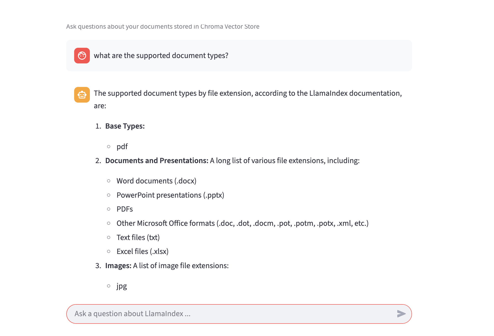

# LlamaIndex Documentation Helper (RAG)

A retrieval-augmented generation (RAG) chatbot that lets you ask questions about LlamaIndex documentation. Documents are chunked, embedded locally, stored in ChromaDB, and served through a Streamlit chat UI backed by a local Ollama LLM.

## How it works

1. **Ingest** — `ingest.py` reads the docs, splits them into chunks, generates embeddings with a local HuggingFace model, and stores them in a persistent ChromaDB collection.
2. **Chat** — `app.py` loads the ChromaDB index at startup and exposes a Streamlit chat interface. Each user message is answered using context retrieved from the vector store, with Jaccard-based deduplication applied to the retrieved nodes before passing them to the LLM.

## Tech stack

| Layer | Tool |
|---|---|
| Document loading | LlamaIndex `SimpleDirectoryReader` |
| Chunking | LlamaIndex `SentenceSplitter` |
| Embeddings | `sentence-transformers/all-MiniLM-L6-v2` (HuggingFace, runs locally) |
| Vector store | ChromaDB (persistent, local) |
| LLM | Llama 3.2 via Ollama (runs locally) |
| RAG framework | LlamaIndex |
| Chat UI | Streamlit |

## Prerequisites

- Python 3.9+
- [Ollama](https://ollama.com) installed and running with the `llama3.2` model pulled:
  ```bash
  ollama pull llama3.2
  ```
- Python dependencies:
  ```bash
  pip install llama-index llama-index-embeddings-huggingface llama-index-llms-ollama llama-index-vector-stores-chroma chromadb streamlit sentence-transformers
  ```

## Project structure

```
documentation_helper_rag/
├── ingest.py          # One-time ingestion script
├── app.py             # Streamlit chat app
├── llamaindex-docs/   # Source documents (markdown / text files)
└── chroma_db/         # Persisted ChromaDB vector store (auto-created)
```

## Commands

### 1. Ingest documents

Run once (or whenever the docs change) to build the vector store:

```bash
python3 ingest.py
```

Ingestion is done in batches to respect ChromaDB's maximum batch size. Progress bars show parsing and embedding stages. A chunk quality analysis and a test query are printed on completion.

### 2. Launch the chat app

```bash
python3 -m streamlit run app.py
```

Then open [http://localhost:8501](http://localhost:8501) in your browser.

## Configuration

Key constants are defined at the top of each script:

| Constant | File | Default | Description |
|---|---|---|---|
| `DATA_DIR` | `ingest.py` | `./llamaindex-docs` | Source documents directory |
| `NUM_DOCS` | `ingest.py` | `800` | Max number of documents to load |
| `CHUNK_SIZE` | `ingest.py` | `500` | Token target per chunk |
| `CHUNK_OVERLAP` | `ingest.py` | `100` | Overlap between adjacent chunks |
| `EMBED_MODEL_NAME` | both | `all-MiniLM-L6-v2` | HuggingFace embedding model |
| `TOKEN_LIMIT` | `app.py` | `3000` | Chat memory token budget |
| `JACCARD_THRESHOLD` | `app.py` | `0.85` | Deduplication similarity threshold |


